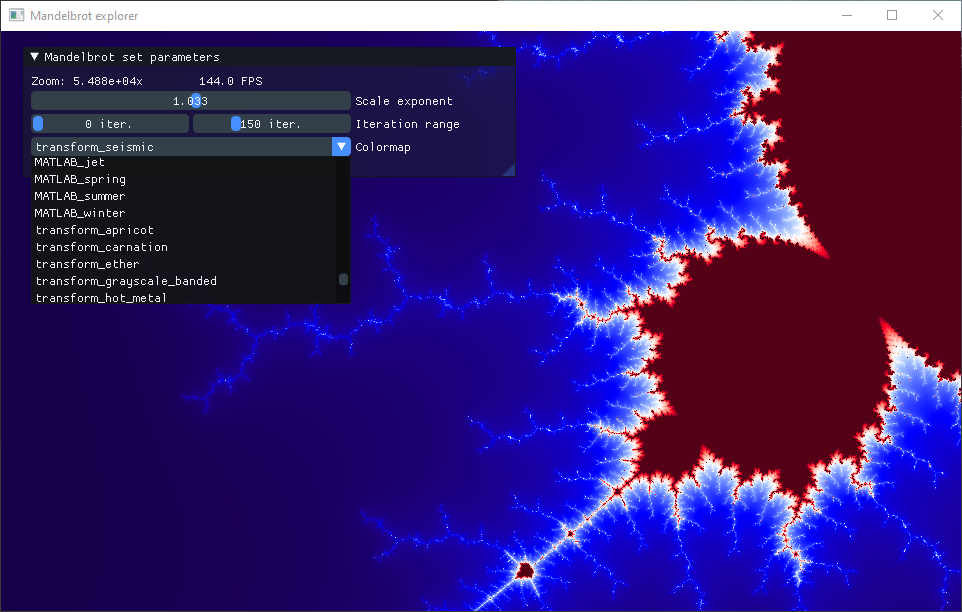

# Mandelbrot explorer
A Mandelbrot set viewer made with OpenGL, SDL2 and C++. To explore the set you can pan with any mouse button and zoom in and out with the mouse wheel. Using the small GUI window you can also customize a few parameters to change the visualization.

## Building
To build you will need CMake 3.11+, C++17 and SDL2. If SDL2 cannot be found by CMake you need to specify the path to its folder with the variable `SDL2_DIR` (ex: `cmake .. -DSDL2_DIR=<path>`). Furthermore, you will need to add a cmake file to SDL2 root folder to enable cmake to regonize it, you can follow [this](https://trenki2.github.io/blog/2017/06/02/using-sdl2-with-cmake/) short tutorial. 

This repo also uses submodules, so don't forget to clone it using `git clone --recursive`.

## External code
- The colormap shaders are from [kbinani/colormap-shaders](https://github.com/kbinani/colormap-shaders).
- The GUI is made using [Dear ImGui](https://github.com/ocornut/imgui). 
- The rendering, window creation and inputs are managed using [luihabl/tinysdl](https://github.com/luihabl/tinysdl). 